  

 

 

> ### *"Stay focused. Stay dangerous."*

 

## 👩🏻‍💻 Mission Briefing

I'm **Meenakshi Cherukuri** — a Software Engineer based in **AP, India**, holding an **Integrated B.Tech in CSE-AIML** from **SASI INSTITUTE OF TECHNOLOGY & ENGINEERING**.

My trajectory is defined by a relentless drive to solve complex problems, build scalable full-stack applications, and push the boundaries of AI/ML integrations.

- 🚀 Focused on building **low-code platforms** and event-driven **microservices** at scale.
- 👁️ Developing scalable **MERN Stack** projects
- 🤖 Exploring **LLMs, LangChain, RAG & AI Agents** 
- 🧩 **500+ CodeChef & 150+ LeetCode** problems solved
- ♟️ Chess · 🏸 Badminton · 🎧 Music · ✍️ Tech Blogging

 

## 🛠 Tech Stack

**Frontend**
- React, Vue, JavaScript  
- HTML, CSS, Bootstrap  

**Backend**
- Node.js, Express.js, Laravel, SQL, MongoDB  

**Languages**
- Java, Python, Php, C

**Tools & Platforms**
- Git, GitHub, VS Code, Postman, Figma
- Jira, Miro, Confluence, Asana, Fabric

## 🎯 Current Focus
- Deep-Diving into **Cloud Computing**, **AWS**, and **DevOps** to build production-ready systems
- Sharpening algorithmic thinking through **DSA** **Data Structures & Algorithms** for long-term growth

## 📊 Developer Metrics

  

## 🚀 Pac-Man — Contribution Graph Game
<picture>
    <source media="(prefers-color-scheme: dark)" srcset="pacman-dark.svg">
    <source media="(prefers-color-scheme: light)" srcset="pacman.svg">
    
</picture>

